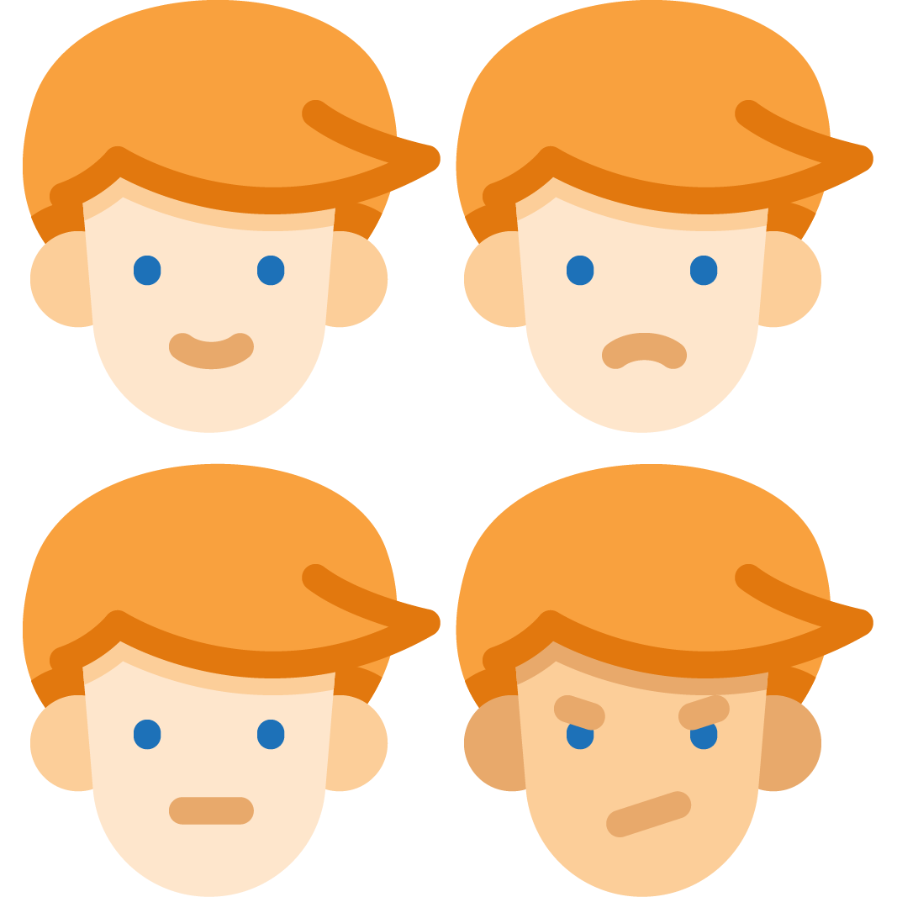

 SFaceCompare: Easy to use library for face matching.
======================================

SFaceCompare is an simple libray for iOS to find and compare faces.
SFaceCompare works on top of dlib and OpenCV libraries. With usage of trained model.

## Features

- [x] Face detecting / extracting
- [x] Face aligment
- [x] Face matching
- [ ] Support iOS 11.0
- [ ] Complete Documentation
- [ ] Test coverage

## Used Libraries

- [dlib](https://github.com/davisking/dlib) - Image processing
- [openCV](https://github.com/opencv/opencv) - Detecting face landmarks and face alignment

## Requirements

- iOS 11.3+
- Xcode 8.3+
- Swift 3.1+

## Installation

### CocoaPods

[CocoaPods](http://cocoapods.org) is a dependency manager for Cocoa projects. You can install it with the following command:

```bash
$ gem install cocoapods
```

> CocoaPods 1.1+ is required to build SFaceCompare.

To integrate SFaceCompare into your Xcode project using CocoaPods, specify it in your `Podfile`:

```ruby
source 'https://github.com/CocoaPods/Specs.git'
platform :ios, '11.3'
use_frameworks!

target '<Your Target Name>' do
    pod 'SFaceCompare'
end
```

Then, run the following command:

```bash
$ pod install
```

## Credits

SFaceCompare is owned and maintained by [Bohdan Mihiliev](https://github.com/BohdanNikoletti) & [Anton Khrolenko](https://github.com/Thromkir)

## License

SFaceCompare is released under the MIT license. [See LICENSE](https://github.com/BohdanNikoletti/SFaceCompare/blob/master/LICENSE) for details.
